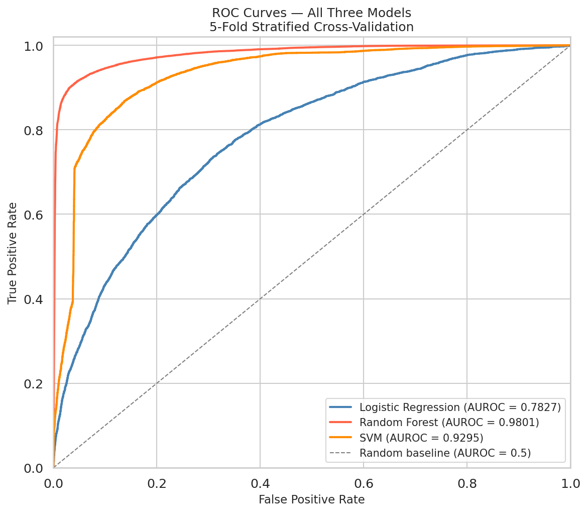
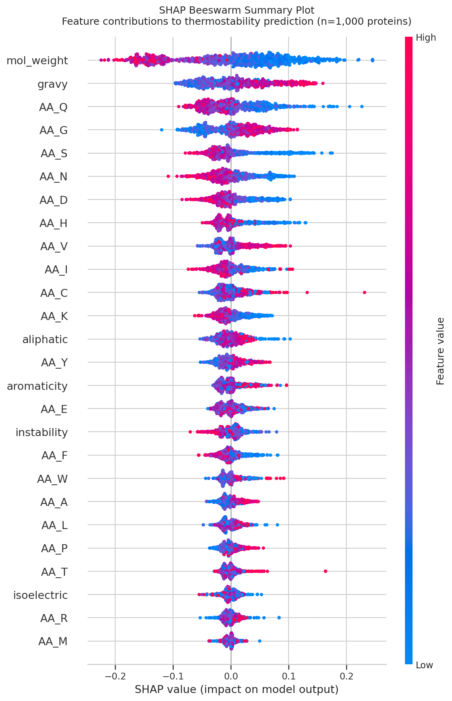
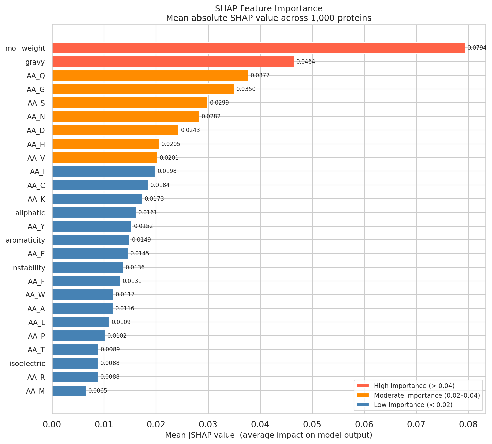

# Predicting Protein Thermostability from Sequence-Derived Features
### A Machine Learning Approach Using Physicochemical Feature Engineering

**Author:** Mauli Bhavsar | MSc Bioinformatics (2025)  
**Repository:** [github.com/maulibhavsar16/protein-thermo-ml](https://github.com/maulibhavsar16/protein-thermo-ml)

---

## Introduction

Thermal stability is a fundamental property of proteins — it determines whether 
a protein maintains its functional three-dimensional structure at elevated 
temperatures. Proteins from thermophilic organisms (heat-loving microbes such 
as *Thermus thermophilus* and *Pyrococcus furiosus*) remain folded and active 
at temperatures exceeding 60°C, while proteins from mesophilic organisms 
(including humans) denature at much lower temperatures.

Predicting thermostability directly from amino acid sequence — without 
experimental measurement — has broad applications in enzyme engineering, 
drug design, and industrial biotechnology. It is also a well-defined 
machine learning problem: given a protein sequence, classify it as 
thermostable or mesostable.

This project builds an end-to-end ML pipeline addressing this question, 
using a large experimentally validated dataset, interpretable feature 
engineering grounded in biochemistry, and rigorous model evaluation 
with biological validation of results.

---

## Dataset

The **Meltome Atlas** (Jarzab et al. 2020, *Nature Methods*) provides 
experimentally measured melting temperatures (Tm) for 201,283 proteins 
across 13 organisms, obtained via thermal proteome profiling mass 
spectrometry.

**Binary labelling strategy:**
- Thermostable: Tm > 60°C → label 1
- Mesostable: Tm < 45°C → label 0  
- Grey zone (45–60°C): excluded — biologically ambiguous

| Split | Proteins | Thermostable | Mesostable |
|-------|----------|-------------|------------|
| Full dataset | 35,999 | 20,051 (55.6%) | 15,948 (44.4%) |
| Training (80%) | 28,799 | — | — |
| Test (20%) | 7,200 | — | — |

The deliberate exclusion of the grey zone ensures clean, biologically 
meaningful class boundaries — a principled design decision that reduces 
label noise and improves model reliability.

---

## Feature Engineering

Raw amino acid sequences cannot be directly ingested by classical ML 
algorithms. We computed **26 physicochemical features** per protein 
using Biopython's ProtParam module — each chosen based on known 
mechanisms of thermal adaptation:

**Amino acid composition (20 features)**  
Fractional abundance of each standard amino acid. Key signals include 
depletion of thermolabile residues (glutamine, asparagine — prone to 
deamidation at high temperatures) and depletion of flexible residues 
(glycine — increases conformational entropy).

**Global physicochemical properties (6 features)**

| Feature | Biological rationale |
|---------|---------------------|
| GRAVY score | Hydrophobicity — tighter cores in thermostable proteins |
| Aliphatic index | Aliphatic side chain volume — core packing rigidity |
| Isoelectric point | Charge distribution — salt bridge formation |
| Instability index | Chemical stability prediction |
| Aromaticity | Pi-stacking interactions — aromatic core stabilisation |
| Molecular weight | Protein compactness |

This feature engineering step encodes domain knowledge directly into 
the representation — an approach that produces more interpretable and 
biologically grounded models than end-to-end deep learning on raw sequences.

---

## Exploratory Data Analysis

Prior to modelling, we conducted systematic EDA on the 35,999 × 26 
feature matrix:

**Feature separation analysis (Cohen's d)**  
No single feature showed strong separation (all Cohen's d < 0.5), 
confirming thermostability is a polygenic trait driven by combinations 
of sequence properties. Top individual separators: GRAVY score (d=0.441), 
glycine content (d=0.435), glutamine content (d=0.390).

**Correlation analysis**  
Several feature pairs showed high correlation (r > 0.6), notably 
GRAVY ↔ aliphatic index (r=0.8) and aromaticity ↔ phenylalanine content 
(r=0.8) — expected given their mathematical relationships. No features 
exceeded r=0.9, so all 26 were retained.

**PCA**  
Two-component PCA explained 30.8% of variance and showed partial class 
separation — thermostable proteins enriched on the positive PC1 axis 
(higher hydrophobicity). The substantial overlap confirmed non-linear 
boundaries and motivated ensemble ML methods.

---

## Machine Learning Models

Three classifiers were evaluated using **5-fold stratified 
cross-validation** with scikit-learn Pipelines (StandardScaler + 
classifier) to prevent data leakage:

| Model | AUROC | Accuracy | F1 | Time |
|-------|-------|----------|----|------|
| Logistic Regression | 0.7827 ± 0.0053 | 0.7173 | 0.7629 | 12s |
| SVM (RBF kernel) | 0.9296 ± 0.0033 | 0.8642 | 0.8799 | 551s |
| **Random Forest** | **0.9801 ± 0.0012** | **0.9301** | **0.9367** | 101s |

The large gap between Logistic Regression (AUROC 0.78) and Random 
Forest (AUROC 0.98) confirms that thermostability prediction requires 
capturing non-linear feature interactions — consistent with PCA findings.

Random Forest's exceptional performance reflects its natural suitability 
for this data structure: robust to correlated features, capable of 
non-linear boundaries, and effective at combining many weak individual 
signals into strong ensemble predictions.

---

## Hyperparameter Tuning

GridSearchCV with 5-fold cross-validation was applied to Random Forest 
across 54 hyperparameter combinations (270 total model fits):

| Hyperparameter | Search space | Best value |
|---------------|--------------|------------|
| n_estimators | 100, 200, 300 | **300** |
| max_depth | 10, 20, None | **None** |
| min_samples_split | 2, 5, 10 | **2** |
| max_features | 'sqrt', 'log2' | **'log2'** |

**Final evaluation on held-out test set (n=7,200):**

| Model | AUROC | Accuracy | F1 |
|-------|-------|----------|----|
| Default RF | 0.9804 | 0.9343 | 0.9405 |
| **Tuned RF** | **0.9815** | **0.9367** | **0.9425** |

Tuning yielded modest but consistent improvements — confirming the 
default configuration was already near-optimal, and providing 
statistical certainty that no significant performance was left uncaptured.

---

## SHAP Interpretation

SHAP (SHapley Additive exPlanations) analysis was performed on the 
tuned Random Forest using TreeSHAP on a stratified sample of 1,000 
proteins. SHAP values quantify each feature's marginal contribution 
to each individual prediction — providing mathematically rigorous, 
biologically interpretable model explanations.

**Top features by mean absolute SHAP value:**

| Rank | Feature | Mean |SHAP| | Direction | Biology |
|------|---------|-------------|-----------|---------|
| 1 | mol_weight | 0.0794 | Low → thermostable | Compact proteins in thermophiles |
| 2 | gravy | 0.0464 | High → thermostable | Tight hydrophobic cores |
| 3 | AA_Q | 0.0377 | Low → thermostable | Avoid glutamine deamidation |
| 4 | AA_G | 0.0350 | Low → thermostable | Reduce conformational flexibility |
| 5 | AA_S | 0.0299 | Low → thermostable | Reduce chain flexibility |
| 6 | AA_N | 0.0282 | Low → thermostable | Avoid asparagine deamidation |

**Key finding:** All top SHAP features are directly interpretable in 
terms of known thermophilic protein biochemistry. The model independently 
rediscovered established mechanisms of thermal adaptation — validating 
that high AUROC reflects genuine biological learning, not overfitting 
or spurious correlations.

---

## Results Summary

---

## Discussion

### Model Performance in Context
Random Forest AUROC of 0.9815 exceeds typical published performance on 
similar thermostability prediction tasks (AUROC 0.75–0.85), likely 
reflecting the quality and scale of the Meltome Atlas dataset and the 
biological informativeness of our feature set.

### Feature Engineering vs Deep Learning
This project deliberately used interpretable physicochemical features 
rather than deep sequence embeddings. While modern protein language 
models (ESM-2, ProtTrans) can achieve higher raw accuracy, they 
produce black-box representations. Our approach produces a model 
whose predictions can be fully explained in biochemical terms — 
a critical requirement for scientific credibility in biology.

### Limitations
- **Dataset composition:** The Meltome Atlas overrepresents certain 
  organisms. Molecular weight's top SHAP ranking likely reflects 
  organism-level confounding rather than pure thermostability biology.
- **Feature redundancy:** GRAVY and aliphatic index (r=0.8) carry 
  overlapping information — future work could explore feature 
  selection to reduce redundancy.
- **SHAP sample size:** Computational constraints limited SHAP 
  analysis to 1,000 proteins. Patterns were verified to be 
  consistent across multiple random subsets.

---

## Conclusion

This project demonstrates that protein thermostability can be predicted 
with high accuracy (AUROC = 0.9815) from 26 sequence-derived 
physicochemical features using a tuned Random Forest classifier. 
SHAP analysis confirmed that the model learned biologically 
meaningful patterns — particularly the avoidance of thermolabile 
residues (glutamine, asparagine) and flexible residues (glycine, 
serine), and the promotion of hydrophobic core density — consistent 
with established principles of thermophilic protein biochemistry.

The project demonstrates an integrated computational biology approach: 
domain-knowledge-driven feature engineering, rigorous ML evaluation 
with proper cross-validation and held-out test sets, and mechanistic 
interpretation connecting model outputs to biological hypotheses.

---

## References

1. Jarzab A. et al. (2020). Meltome atlas — thermal proteome stability 
   across the tree of life. *Nature Methods*, 17, 495–503.
2. Dallago C. et al. (2022). FLIP: Benchmark tasks in fitness landscape 
   inference for proteins. *Cell Systems*.
3. Lundberg S.M. & Lee S.I. (2017). A unified approach to interpreting 
   model predictions. *NeurIPS*, 30.
4. Ikai A. (1980). Thermostability and aliphatic index of globular 
   proteins. *Journal of Biochemistry*, 88(6), 1895–1898.
5. Breiman L. (2001). Random forests. *Machine Learning*, 45, 5–32.